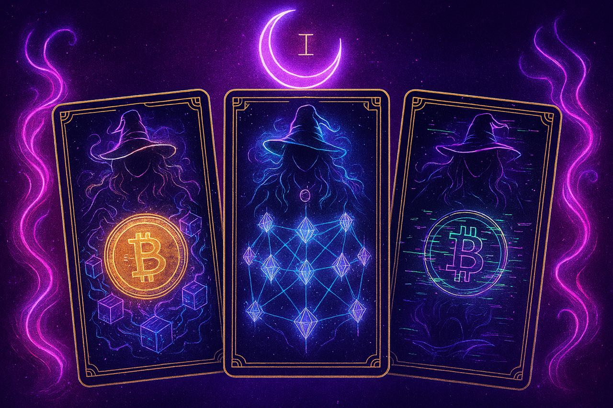

<p align="center">
  
</p>

# 🌙 Anastasiia Kaplenko | Solidity & AI Developer  

> 🧙‍♀️ Web3 Witch • Solidity Architect • AI Explorer  

---

### 🧰 Tech Stack  
- **Solidity** — ERC-20 / ERC-721 / DeFi / Proxy / Factory  
- **Hardhat**, **JavaScript**, **Web3.js**  
- **Python (TensorFlow / PyTorch)**  
- **AI, Machine Learning, Reinforcement Learning**  
- **Remote Education:** Moscow (online)  
- 🌍 Currently based in Serbia  

---

### 🚀 Featured Projects  

#### 🪙 Token Contract  
Smart ERC-20 token with mint & burn functionality.  
🔗 [GitHub link]  
💬 **1000+ interactions** on Sepolia testnet.  

#### 🤖 AI Predictor  
Machine Learning model for data forecasting & classification.  
🔗 [GitHub link]  
🎯 **95 % accuracy** on validation set.  

#### 💰 DeFi Bot  
A minimal smart contract for future DeFi automation.  
```solidity
// Save as DeFiBot.sol
// SPDX-License-Identifier: MIT
pragma solidity ^0.8.27;

contract DeFiBot {
    event Swapped(address indexed user, uint256 amountIn, uint256 amountOut);

    function swap() public {
        // Future logic for Uniswap V3 + Chainlink Oracle
        emit Swapped(msg.sender, 0, 0);
    }
}

